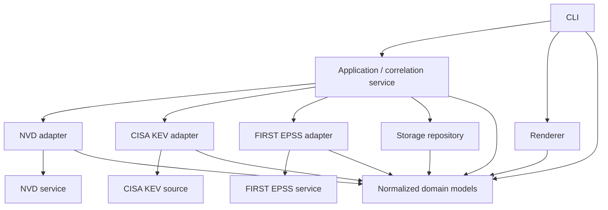

# Architecture

## Status

This document defines the planned v0.1 boundaries. No application modules exist
yet. Future Issues must choose module names that preserve these responsibilities
without treating this diagram as implemented code.

## Components and Responsibilities

- **CLI:** parses commands, validates basic input, selects options such as forced
  refresh, invokes the application service, and maps expected failures to exit
  codes.
- **Application/correlation service:** orchestrates cache lookup, source
  retrieval, normalization, partial-result policy, and persistence.
- **Source adapters:** own HTTP transport and source-specific parsing for NVD,
  CISA KEV, and FIRST EPSS.
- **Domain models:** represent normalized vulnerability data, provenance, and
  source outcomes without framework dependencies.
- **Storage repository:** reads and writes normalized cached briefings behind an
  interface.
- **Renderer:** converts normalized results and errors into terminal output.

## Runtime Orchestration Flow

This diagram shows expected runtime calls and data participation. It does not
define Python import direction.

## Import and Dependency Boundaries

- Domain models own no infrastructure dependencies.
- Application logic depends on adapter and repository contracts.
- Infrastructure implementations depend on and satisfy those contracts.
- CLI and renderer consume application- and domain-facing interfaces.
- A runtime call from application logic to an adapter does not mean domain code
  imports adapter implementation details.

Imports point toward normalized domain and application contracts, never from
domain models into infrastructure.

## Forbidden Dependencies

- Domain models must not depend on Typer, Rich, HTTPX, or SQLite.
- Adapters must not import CLI or rendering modules.
- Renderer must not call adapters, HTTP clients, or storage.
- CLI must not issue HTTP requests or parse source-specific JSON.
- Storage must not contain presentation logic.
- Source-specific response models must not become shared domain models.

## Planned Lookup Workflow

1. CLI validates and normalizes a CVE identifier.
2. Application service checks storage unless forced refresh is requested.
3. A valid cache hit is returned without external calls.
4. On miss or refresh, the service requests NVD, CISA KEV, and FIRST EPSS data
   through their adapters.
5. Adapters return normalized values, explicit no-match results, or typed
   failures.
6. Correlation produces one briefing with provenance and source outcomes.
7. Successful normalized results are saved through storage.
8. CLI passes the result to the renderer.

Cache validity duration is not decided. The cache Issue must define it before
implementation; documentation must not invent a default.

## Partial-Source Failures

NVD is the primary source for a complete briefing. NVD unavailability,
malformed data, or absence of the requested CVE produces an expected typed
failure and prevents a complete result.

CISA KEV and FIRST EPSS are optional enrichments. Their failure must not discard
valid NVD data. The result records whether each optional source returned a
match, returned no match, was unavailable, or returned malformed data. The
renderer makes incomplete enrichment visible without exposing internal
tracebacks.

See [data model](data-model.md), [source contracts](source-contracts.md), and
[ADR 0001](decisions/0001-use-source-adapters.md).
